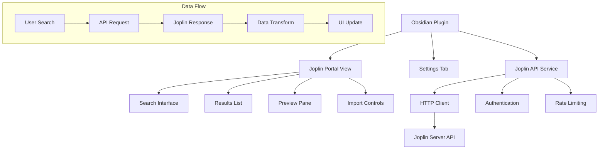

# Design Document

## Overview

The Joplin Portal plugin is an Obsidian plugin that provides seamless access to Joplin notes through a dedicated sidebar panel. The plugin leverages Joplin's REST API to search, preview, and import notes while maintaining a clean separation between the user's Joplin archive and their active Obsidian vault.

The architecture follows Obsidian's plugin patterns with a main plugin class, dedicated view components, and service layers for API communication and data transformation.

## Architecture

### High-Level Architecture



### Plugin Structure

The plugin follows Obsidian's standard architecture:

- **Main Plugin Class**: Extends Obsidian's `Plugin` class, manages lifecycle
- **View Component**: Custom view for the sidebar panel
- **Service Layer**: Handles Joplin API communication
- **Settings**: Configuration management for server connection
- **Data Models**: TypeScript interfaces for type safety

## Components and Interfaces

### 1. Main Plugin Class (`JoplinPortalPlugin`)

```typescript
export default class JoplinPortalPlugin extends Plugin {
    settings: JoplinPortalSettings;
    joplinService: JoplinApiService;

    async onload(): Promise<void>
    async onunload(): Promise<void>
    async loadSettings(): Promise<void>
    async saveSettings(): Promise<void>
}
```

**Responsibilities:**
- Plugin lifecycle management
- Settings persistence
- View registration
- Service initialization

### 2. Joplin Portal View (`JoplinPortalView`)

```typescript
export class JoplinPortalView extends ItemView {
    plugin: JoplinPortalPlugin;
    searchInput: HTMLInputElement;
    resultsContainer: HTMLElement;
    previewContainer: HTMLElement;

    getViewType(): string
    getDisplayText(): string
    async onOpen(): Promise<void>
    async onClose(): Promise<void>
}
```

**Responsibilities:**
- Render search interface
- Display search results
- Handle user interactions
- Manage import workflow

### 3. Joplin API Service (`JoplinApiService`)

```typescript
export class JoplinApiService {
    private baseUrl: string;
    private token: string;
    private httpClient: HttpClient;

    async testConnection(): Promise<boolean>
    async searchNotes(query: string, options?: SearchOptions): Promise<JoplinNote[]>
    async getNote(id: string): Promise<JoplinNote>
    async searchByTag(tag: string): Promise<JoplinNote[]>
}
```

**Responsibilities:**
- HTTP communication with Joplin API
- Authentication handling
- Request/response transformation
- Error handling and retries

### 4. Settings Component (`JoplinPortalSettingTab`)

```typescript
export class JoplinPortalSettingTab extends PluginSettingTab {
    plugin: JoplinPortalPlugin;

    display(): void
    private async testConnection(): Promise<void>
}
```

**Responsibilities:**
- Settings UI rendering
- Connection validation
- Configuration persistence

## Data Models

### Core Interfaces

```typescript
interface JoplinPortalSettings {
    serverUrl: string;
    apiToken: string;
    defaultImportFolder: string;
    importTemplate: string;
    searchLimit: number;
}

interface JoplinNote {
    id: string;
    title: string;
    body: string;
    created_time: number;
    updated_time: number;
    parent_id: string;
    tags?: string[];
    source_url?: string;
}

interface SearchResult {
    note: JoplinNote;
    snippet: string;
    relevance: number;
    selected: boolean;
}

interface ImportOptions {
    targetFolder: string;
    applyTemplate: boolean;
    templatePath?: string;
    conflictResolution: 'skip' | 'overwrite' | 'rename';
}
```

### API Response Models

```typescript
interface JoplinApiResponse<T> {
    items: T[];
    has_more: boolean;
}

interface JoplinSearchResponse extends JoplinApiResponse<JoplinNote> {
    // Inherits items and has_more
}
```

## Error Handling

### Error Categories

1. **Connection Errors**
   - Network timeouts
   - Server unavailable
   - Invalid credentials

2. **API Errors**
   - Rate limiting
   - Invalid requests
   - Server errors

3. **Import Errors**
   - File system permissions
   - Invalid markdown conversion
   - Naming conflicts

### Error Handling Strategy

```typescript
class ErrorHandler {
    static handleApiError(error: JoplinApiError): UserFriendlyError
    static handleImportError(error: ImportError): UserFriendlyError
    static showErrorNotice(error: UserFriendlyError): void
}
```

**Implementation:**
- Exponential backoff for transient errors
- User-friendly error messages
- Detailed logging for debugging
- Graceful degradation when possible

## Testing Strategy

### Unit Tests

- **API Service Tests**: Mock HTTP responses, test error handling
- **Data Transformation Tests**: Verify markdown conversion accuracy
- **Settings Tests**: Validate configuration persistence

### Integration Tests

- **End-to-End Search Flow**: Search → Results → Preview → Import
- **API Integration**: Test against real Joplin server (optional)
- **Obsidian Integration**: Verify plugin lifecycle and UI integration

### Test Structure

```typescript
describe('JoplinApiService', () => {
    describe('searchNotes', () => {
        it('should return formatted search results')
        it('should handle empty results gracefully')
        it('should retry on network errors')
    })

    describe('authentication', () => {
        it('should validate API tokens')
        it('should handle invalid credentials')
    })
})
```

### Manual Testing Scenarios

1. **Connection Setup**: Test various server configurations
2. **Search Functionality**: Test different query types and edge cases
3. **Import Workflow**: Test various import scenarios and conflict resolution
4. **Error Conditions**: Test offline scenarios and API failures

## Implementation Considerations

### Performance Optimizations

- **Debounced Search**: Prevent excessive API calls during typing
- **Result Caching**: Cache recent search results for faster navigation
- **Lazy Loading**: Load note content only when previewed
- **Pagination**: Handle large result sets efficiently

### Security Considerations

- **Token Storage**: Secure storage of API tokens in Obsidian settings
- **Input Validation**: Sanitize user inputs before API calls
- **HTTPS Enforcement**: Require secure connections to Joplin server
- **Content Sanitization**: Clean imported content to prevent XSS

### Extensibility

- **Plugin Hooks**: Allow other plugins to extend functionality
- **Custom Templates**: Support user-defined import templates
- **Search Filters**: Extensible filtering system
- **Export Options**: Future support for exporting to Joplin

### Joplin API Integration Details

Based on the Joplin API documentation:

- **Base URL**: Typically `http://localhost:41184` (configurable)
- **Authentication**: Token-based via query parameter
- **Search Endpoint**: `GET /search?query=YOUR_QUERY&fields=id,title,body,created_time,updated_time`
- **Note Retrieval**: `GET /notes/:id` for full note content
- **Pagination**: Built-in support with `page` and `limit` parameters
- **Rate Limiting**: Implement client-side throttling to respect server limits