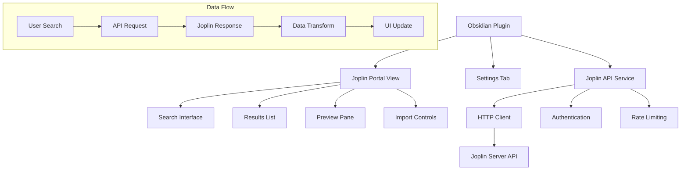
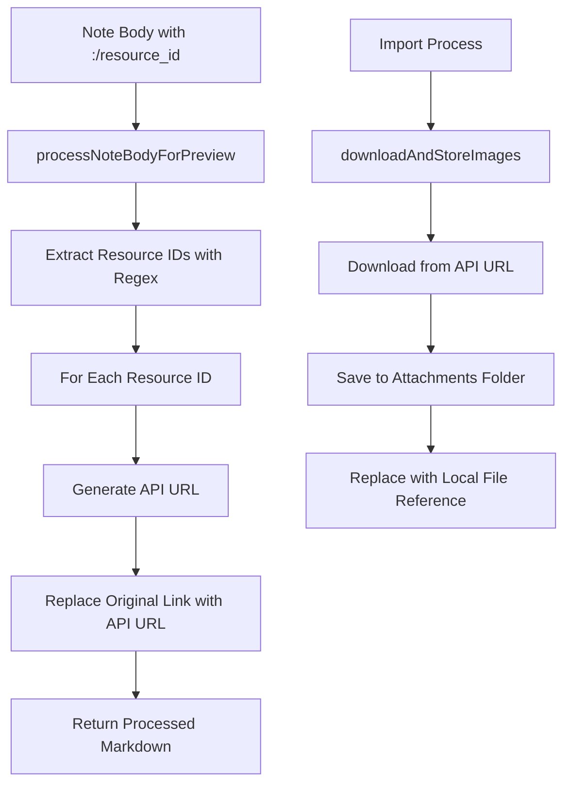
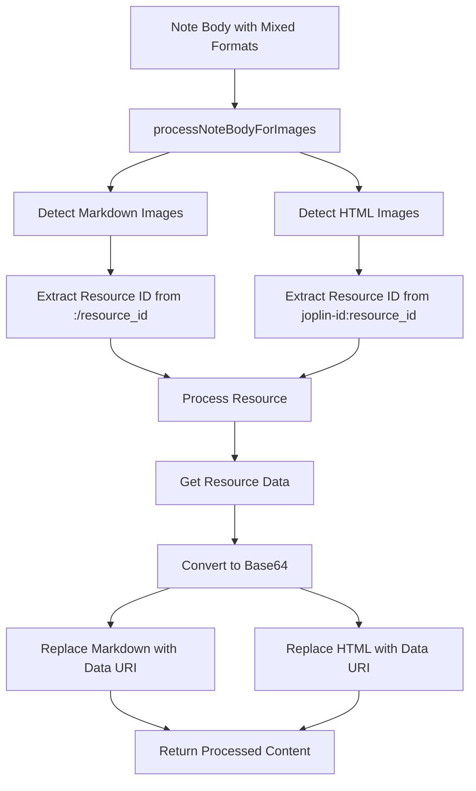
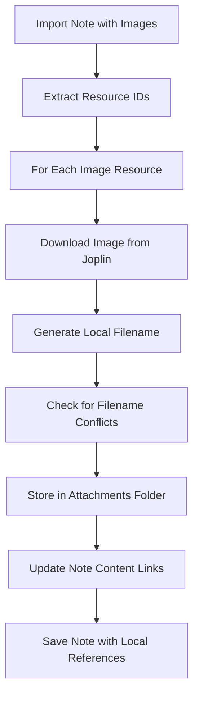

# Design Document

## Overview

The Joplin Portal plugin is an Obsidian plugin that provides seamless access to Joplin notes through a dedicated sidebar panel. The plugin leverages Joplin's REST API to search, preview, and import notes while maintaining a clean separation between the user's Joplin archive and their active Obsidian vault.

The architecture follows Obsidian's plugin patterns with a main plugin class, dedicated view components, and service layers for API communication and data transformation.

## Architecture

### High-Level Architecture



### Plugin Structure

The plugin follows Obsidian's standard architecture:

- **Main Plugin Class**: Extends Obsidian's `Plugin` class, manages lifecycle
- **View Component**: Custom view for the sidebar panel
- **Service Layer**: Handles Joplin API communication
- **Settings**: Configuration management for server connection
- **Data Models**: TypeScript interfaces for type safety

## Components and Interfaces

### 1. Main Plugin Class (`JoplinPortalPlugin`)

```typescript
export default class JoplinPortalPlugin extends Plugin {
    settings: JoplinPortalSettings;
    joplinService: JoplinApiService;

    async onload(): Promise<void>
    async onunload(): Promise<void>
    async loadSettings(): Promise<void>
    async saveSettings(): Promise<void>
}
```

**Responsibilities:**
- Plugin lifecycle management
- Settings persistence
- View registration
- Service initialization

### 2. Joplin Portal View (`JoplinPortalView`)

```typescript
export class JoplinPortalView extends ItemView {
    plugin: JoplinPortalPlugin;
    searchInput: HTMLInputElement;
    resultsContainer: HTMLElement;
    previewContainer: HTMLElement;

    getViewType(): string
    getDisplayText(): string
    async onOpen(): Promise<void>
    async onClose(): Promise<void>
}
```

**Responsibilities:**
- Render search interface
- Display search results
- Handle user interactions
- Manage import workflow

### 3. Joplin API Service (`JoplinApiService`)

```typescript
export class JoplinApiService {
    private baseUrl: string;
    private token: string;
    private httpClient: HttpClient;

    async testConnection(): Promise<boolean>
    async searchNotes(query: string, options?: SearchOptions): Promise<SearchResult[]>
    async searchNotesByTags(tagOptions: TagSearchOptions): Promise<SearchResult[]>
    async getNote(id: string): Promise<JoplinNote>
    async processNoteBodyForPreview(noteBody: string): string
    async getResourceUrl(resourceId: string): string
}
```

**Responsibilities:**
- HTTP communication with Joplin API using correct tag search syntax
- Authentication handling
- Request/response transformation with proper tag search implementation
- Error handling and retries
- Image resource URL generation for preview
- Accurate tag search using "tag:" prefix syntax

### 4. Settings Component (`JoplinPortalSettingTab`)

```typescript
export class JoplinPortalSettingTab extends PluginSettingTab {
    plugin: JoplinPortalPlugin;

    display(): void
    private async testConnection(): Promise<void>
}
```

**Responsibilities:**
- Settings UI rendering
- Connection validation
- Configuration persistence

## Data Models

### Core Interfaces

```typescript
interface JoplinPortalSettings {
    serverUrl: string;
    apiToken: string;
    defaultImportFolder: string;
    importTemplate: string;
    searchLimit: number;
}

interface JoplinNote {
    id: string;
    title: string;
    body: string;
    created_time: number;
    updated_time: number;
    parent_id: string;
    tags?: string[];
    source_url?: string;
}

interface TagSearchOptions {
    tags: string[];
    operator: 'AND' | 'OR';
    includeText?: boolean;
    textQuery?: string;
}

interface SearchResult {
    note: JoplinNote;
    snippet: string;
    relevance: number;
    selected: boolean;
}

interface ImportOptions {
    targetFolder: string;
    applyTemplate: boolean;
    templatePath?: string;
    conflictResolution: 'skip' | 'overwrite' | 'rename';
}

interface JoplinResource {
    id: string;
    title: string;
    mime: string;
    filename: string;
    created_time: number;
    updated_time: number;
    user_created_time: number;
    user_updated_time: number;
    file_extension: string;
    encryption_cipher_text: string;
    encryption_applied: number;
    encryption_blob_encrypted: number;
    size: number;
}

interface ImageProcessingResult {
    originalLink: string;
    processedLink: string;
    success: boolean;
    error?: string;
}

interface ImageImportResult {
    resourceId: string;
    originalFilename: string;
    localFilename: string;
    localPath: string;
    success: boolean;
    error?: string;
}

interface ImportService {
    async importNotes(notes: JoplinNote[], options: ImportOptions): Promise<ImportResult[]>
    async downloadAndStoreImages(noteBody: string, attachmentsPath: string): Promise<{processedBody: string, imageResults: ImageImportResult[]}>
    async generateUniqueFilename(baseName: string, extension: string, targetPath: string): Promise<string>
}
```

### API Response Models

```typescript
interface JoplinApiResponse<T> {
    items: T[];
    has_more: boolean;
}

interface JoplinSearchResponse extends JoplinApiResponse<JoplinNote> {
    // Inherits items and has_more
}
```

## Error Handling

### Error Categories

1. **Connection Errors**
   - Network timeouts
   - Server unavailable
   - Invalid credentials

2. **API Errors**
   - Rate limiting
   - Invalid requests
   - Server errors

3. **Import Errors**
   - File system permissions
   - Invalid markdown conversion
   - Naming conflicts

### Error Handling Strategy

```typescript
class ErrorHandler {
    static handleApiError(error: JoplinApiError): UserFriendlyError
    static handleImportError(error: ImportError): UserFriendlyError
    static showErrorNotice(error: UserFriendlyError): void
}
```

**Implementation:**
- Exponential backoff for transient errors
- User-friendly error messages
- Detailed logging for debugging
- Graceful degradation when possible

## Testing Strategy

### Unit Tests

- **API Service Tests**: Mock HTTP responses, test error handling
- **Data Transformation Tests**: Verify markdown conversion accuracy
- **Settings Tests**: Validate configuration persistence

### Integration Tests

- **End-to-End Search Flow**: Search → Results → Preview → Import
- **API Integration**: Test against real Joplin server (optional)
- **Obsidian Integration**: Verify plugin lifecycle and UI integration

### Test Structure

```typescript
describe('JoplinApiService', () => {
    describe('searchNotes', () => {
        it('should return formatted search results')
        it('should handle empty results gracefully')
        it('should retry on network errors')
    })

    describe('authentication', () => {
        it('should validate API tokens')
        it('should handle invalid credentials')
    })
})
```

### Manual Testing Scenarios

1. **Connection Setup**: Test various server configurations
2. **Search Functionality**: Test different query types and edge cases
3. **Import Workflow**: Test various import scenarios and conflict resolution
4. **Error Conditions**: Test offline scenarios and API failures

## Implementation Considerations

### Performance Optimizations

- **Debounced Search**: Prevent excessive API calls during typing
- **Result Caching**: Cache recent search results for faster navigation
- **Lazy Loading**: Load note content only when previewed
- **Pagination**: Handle large result sets efficiently

### Security Considerations

- **Token Storage**: Secure storage of API tokens in Obsidian settings
- **Input Validation**: Sanitize user inputs before API calls
- **HTTPS Enforcement**: Require secure connections to Joplin server
- **Content Sanitization**: Clean imported content to prevent XSS

### Extensibility

- **Plugin Hooks**: Allow other plugins to extend functionality
- **Custom Templates**: Support user-defined import templates
- **Search Filters**: Extensible filtering system
- **Export Options**: Future support for exporting to Joplin

### Joplin API Integration Details

Based on the Joplin API documentation:

- **Base URL**: Typically `http://localhost:41184` (configurable)
- **Authentication**: Token-based via query parameter
- **Search Endpoint**: `GET /search?query=YOUR_QUERY&fields=id,title,body,created_time,updated_time,source_url`
- **Tag Search Syntax**: Use `tag:tagname` format in query parameter for accurate tag searching
- **Multiple Tag Search**: Use `tag:tag1 OR tag:tag2` for OR logic, `tag:tag1 tag:tag2` for AND logic
- **Note Retrieval**: `GET /notes/:id` for full note content including source_url field
- **Resource File**: `GET /resources/:id/file` for direct image access via URL
- **Pagination**: Built-in support with `page` and `limit` parameters
- **Rate Limiting**: Implement client-side throttling to respect server limits

### Search Interface Design

The search interface provides two distinct modes:

1. **Text Search Mode**:
   - Single text input for full-text search
   - Searches note titles and content
   - Uses standard Joplin search query syntax

2. **Tag Search Mode**:
   - Single input for comma-separated tags
   - Uses proper `tag:` prefix syntax for each tag
   - Supports OR logic for multiple tags
   - Returns ALL notes containing specified tags

**Removed Features**:
- Combined search mode (removed for simplicity and clarity)
- Complex search interfaces that could confuse users

### Image Processing Architecture

The image processing system uses direct Joplin API URLs for preview and downloads images for import:



**Preview Image Processing Flow:**
1. **Pattern Detection**: Use regex to find Joplin image links in both markdown and HTML formats
2. **API URL Generation**: Create direct API URLs using `getResourceUrl(resourceId)`
3. **Link Replacement**: Replace Joplin resource links with API URLs for immediate display
4. **Simple and Fast**: No base64 conversion or complex processing needed for preview

**Import Image Processing Flow:**
1. **Resource Extraction**: Identify all image resources during import
2. **File Download**: Download images directly from Joplin API
3. **Local Storage**: Save to Obsidian's attachments folder with unique filenames
4. **Link Conversion**: Replace Joplin links with local file references
5. **Error Handling**: Graceful fallback for failed downloads

### HTML Image Processing Architecture

Some Joplin notes contain HTML img tags with joplin-id URLs instead of markdown format. The system must handle both formats:



**HTML Image Processing Flow:**
1. **HTML Pattern Detection**: Use regex `/]*src=["']joplin-id:([a-f0-9]{32})["'][^>]*>/g` to find HTML img tags
2. **Attribute Preservation**: Extract and preserve existing HTML attributes (width, height, alt, class, style)
3. **Resource ID Extraction**: Extract the 32-character hex resource ID from the joplin-id: URL
4. **Resource Processing**: Use the same resource fetching logic as markdown images
5. **HTML Reconstruction**: Replace the joplin-id: URL with data URI while preserving all other attributes
6. **Fallback Handling**: For failed resources, maintain the original HTML structure with placeholder content

**HTML Image Replacement Examples:**
- Input: ``
- Output: ``

**Dual Format Support:**
- Process both markdown `` and HTML `` in the same note
- Maintain consistent error handling and caching across both formats
- Preserve the original format structure (markdown stays markdown, HTML stays HTML)

### Image Import Architecture

For imported notes, images are downloaded and stored locally in Obsidian:



**Image Import Flow:**
1. **Resource Extraction**: Identify all image resources in note content during import (both markdown and HTML formats)
2. **File Download**: Download each image file from Joplin API as binary data
3. **Filename Generation**: Create appropriate filenames using resource metadata (title, extension)
4. **Conflict Resolution**: Handle duplicate filenames by appending numbers or timestamps
5. **Local Storage**: Save images to Obsidian's configured attachments folder
6. **Link Conversion**:
   - Replace `` with `` for markdown
   - Replace `` with `` for HTML
7. **Note Update**: Save the imported note with local image references and source URL in frontmatter

**Frontmatter Enhancement:**
- Include `joplin-id` for reference back to original note
- Include `created` and `updated` timestamps
- Include `source` field with the original Joplin source URL when available
- Maintain compatibility with existing Obsidian frontmatter standards

**Attachment Management:**
- Use Obsidian's configured attachments folder (typically `attachments/` or vault root)
- Preserve original file extensions when possible
- Generate meaningful filenames from resource metadata
- Handle filename conflicts gracefully with numbering scheme
- Maintain image quality during download and storage