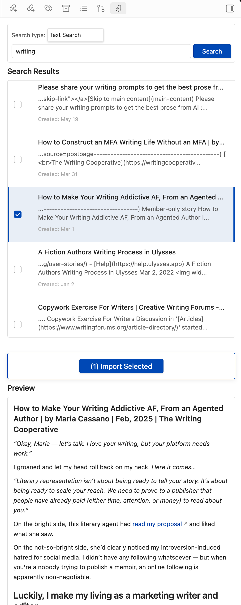
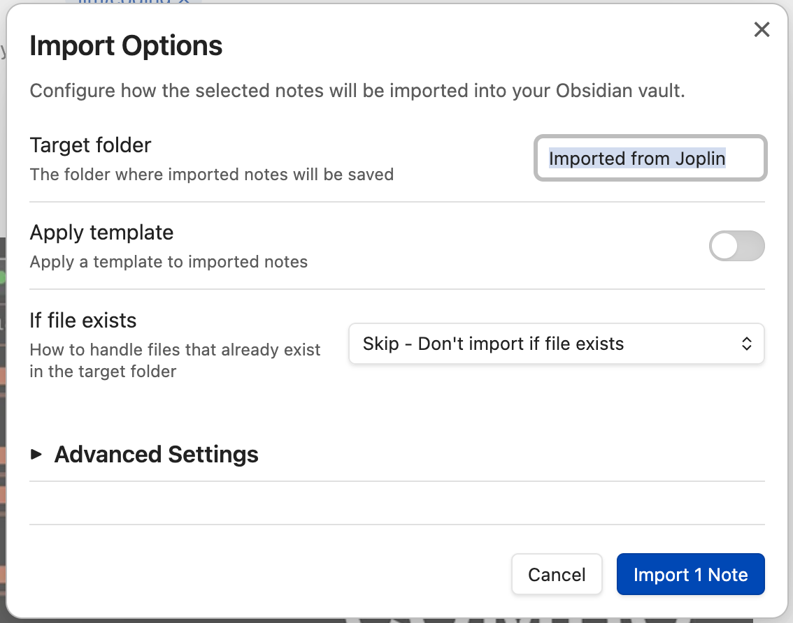
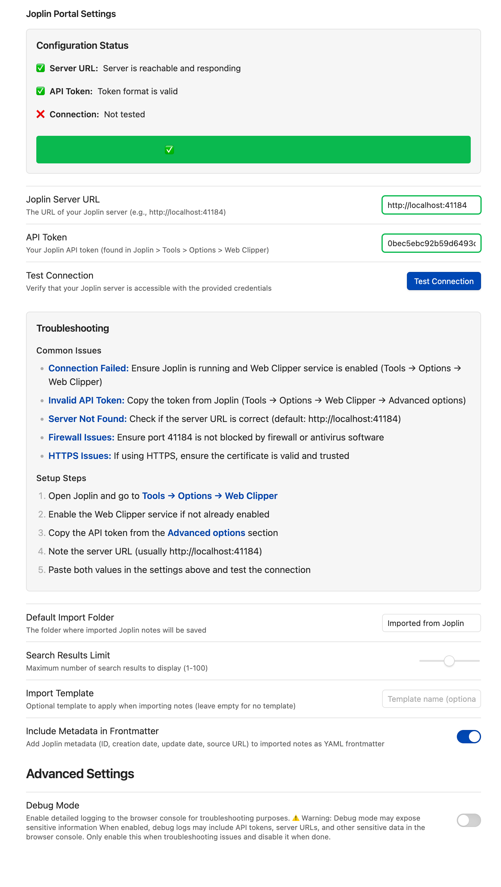

# Joplin Portal

An Obsidian plugin that provides seamless access to your Joplin notes through a dedicated sidebar panel. Search, preview, and selectively import notes from your Joplin server without cluttering your Obsidian vault.

## Features

- 🔍 **Smart Search**: Full-text search across all your Joplin notes with instant results
- 👀 **Live Preview**: Preview note content without leaving Obsidian
- 📥 **Selective Import**: Choose which notes to import with conflict resolution
- 🎨 **Native Integration**: Seamlessly integrates with Obsidian's UI and themes
- 🔒 **Secure Connection**: Direct connection to your Joplin server with API token authentication
- ⚡ **Performance Optimized**: Debounced search, caching, and efficient API usage

## Screenshots

| Search Interface | Import Dialog | Settings Panel |
| :---: | :---: | :---: |
|  |  |  |

## Installation

This plugin is not yet available in the Obsidian Community Plugins marketplace. You can install it manually or using the BRAT plugin.

### Option 1: Manual Installation

1. Download the latest release files (`main.js`, `manifest.json`, and `styles.css`) from the [Releases page](https://github.com/eristoddle/joplin-portal/releases)
2. Create a new folder in your vault's plugins directory: `VaultFolder/.obsidian/plugins/joplin-portal/`
3. Copy the downloaded files into this folder
4. Restart Obsidian or reload the app
5. Go to Settings → Community Plugins and enable "Joplin Portal"

### Option 2: Install with BRAT Plugin (Recommended)

1. Install the [BRAT plugin](https://github.com/TfTHacker/obsidian42-brat) if you haven't already
2. Open the command palette (`Ctrl/Cmd + P`) and run "BRAT: Add a beta plugin for testing"
3. Enter this repository URL: `https://github.com/eristoddle/joplin-portal`
4. Click "Add Plugin" and enable it in Settings → Community Plugins

### Option 3: Build from Source

1. Clone this repository: `git clone https://github.com/eristoddle/joplin-portal.git`
2. Navigate to the plugin folder: `cd joplin-portal`
3. Install dependencies: `npm install`
4. Build the plugin: `npm run build`
5. Copy the built files to your vault's plugins folder as described in Manual Installation

## Setup

### Prerequisites

- A running Joplin server (desktop app with Web Clipper service enabled, or Joplin Server)
- Joplin API token

### Getting Your Joplin API Token

#### From Joplin Desktop App:
1. Open Joplin desktop application
2. Go to **Tools** → **Options** → **Web Clipper**
3. Enable the Web Clipper service if not already enabled
4. Copy the **Authorization token**

#### From Joplin Server:
1. Access your Joplin Server admin panel
2. Navigate to user settings
3. Generate or copy your API token

### Plugin Configuration

1. Open Obsidian Settings → **Joplin Portal**
2. Enter your **Joplin Server URL** (e.g., `http://localhost:41184` for desktop app)
3. Paste your **API Token**
4. Click **Test Connection** to verify the setup
5. Configure optional settings:
   - **Default Import Folder**: Where imported notes will be saved
   - **Search Limit**: Maximum number of search results to display
   - **Debug Mode**: Enable detailed logging for troubleshooting (disabled by default)

## Usage

### Opening the Panel

- Click the Joplin Portal icon in the left sidebar, or
- Use the command palette: `Ctrl/Cmd + P` → "Joplin Portal: Open Panel"

### Searching Notes

1. Open the Joplin Portal panel
2. Type your search query in the search box
3. Results appear instantly with note titles and snippets
4. Click any result to preview the full note content

### Importing Notes

1. Search for the notes you want to import
2. Check the boxes next to notes you want to import
3. Click the **Import Selected** button
4. Choose your target folder (or use the default)
5. Handle any naming conflicts if they arise

### Search Tips

- Use quotes for exact phrases: `"meeting notes"`
- Search by tags: `tag:important`
- Combine terms: `project planning 2024`
- Use wildcards: `meet*` to find "meeting", "meetings", etc.

## Troubleshooting

### Connection Issues

**"Cannot connect to Joplin server"**
- Verify Joplin desktop app is running (if using local server)
- Check that Web Clipper service is enabled in Joplin
- Ensure the server URL is correct (usually `http://localhost:41184`)
- Verify your API token is valid

**"Unauthorized" errors**
- Double-check your API token
- Regenerate the token in Joplin if needed
- Ensure there are no extra spaces in the token

### Import Issues

**"File already exists"**
- Choose a conflict resolution option (Skip, Overwrite, or Rename)
- Consider organizing imports into dated folders

**"Permission denied"**
- Check that Obsidian has write permissions to your vault
- Ensure the target folder path is valid

### Performance Issues

**Slow search results**
- Reduce the search limit in settings
- Use more specific search terms
- Check your Joplin server performance

### Debug Mode

**When to enable debug mode**
- Enable debug mode in plugin settings when troubleshooting issues
- Debug mode provides detailed console logging for developers and advanced users
- **Warning**: Debug mode may expose sensitive information in console logs
- Always disable debug mode in normal usage to keep console clean

## Privacy & Security

- All communication is direct between Obsidian and your Joplin server
- No data is sent to third-party services
- API tokens are stored securely in Obsidian's settings
- Use HTTPS for remote Joplin servers when possible

## Contributing

We welcome contributions! Please see our [Contributing Guide](CONTRIBUTING.md) for details.

### Development Setup

1. Clone the repository: `git clone https://github.com/eristoddle/joplin-portal.git`
2. Install dependencies: `npm install`
3. Start development mode: `npm run dev`
4. Make your changes and test thoroughly
5. Run tests: `npm test`
6. Submit a pull request

## Support

- 🐛 **Bug Reports**: [GitHub Issues](https://github.com/eristoddle/joplin-portal/issues)
- 💡 **Feature Requests**: Create a new issue with the "enhancement" label

## Changelog

See [CHANGELOG.md](CHANGELOG.md) for a detailed history of changes.

## License

This project is licensed under the MIT License - see the [LICENSE](LICENSE) file for details.

## Acknowledgments

- Thanks to the Joplin team for providing a robust API
- Thanks to the Obsidian community for inspiration and feedback
- Built with ❤️ for the note-taking community